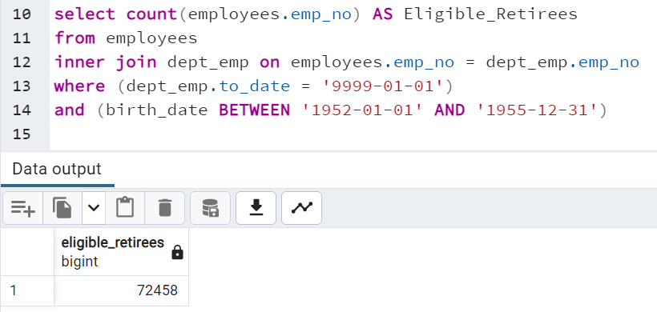
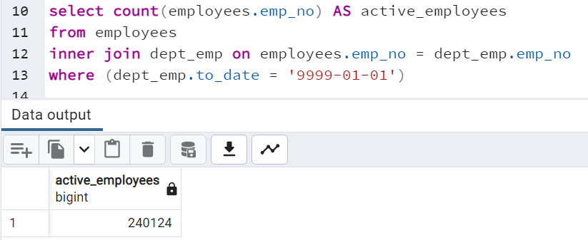
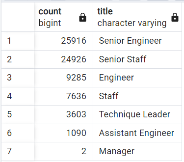
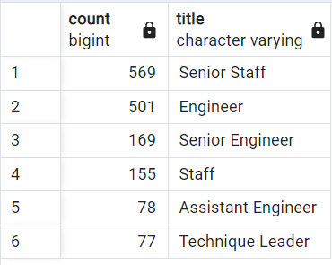

# Module 7: The Silver Tsunami
Using PostgreSQL and PGAdmin14

## Overview
Pewlett-Hackard, a leading technology company, is preparing for a "Silver Tsunami" of retiring staff. This project aims to help management at PH prepare for the impending wave of retirements by determining the number of potential retirees by position and identifying potential replacements for the mentorship program. 

## Results

Based on the data provided:

* 72,458 active employees will be reaching retirement age shortly.
* 50,842 retirement-age employees are in Senior Staff or Senior Engineer positions. 21,616 retirement-age employees are in non-senior positions (i.e., Engineer, Staff, Assistant Engineer, Technique Leader, Manager, etc.)
* 1,549 potential mentees were identified, born in the year 1965.
* Of these potential mentees, 738 are already in Senior Staff or Senior Engineering positions.

## Summary

PH needs to prepare for the Silver Tsunami! 30.2% (72,458) of PH's active employee population (240,124) will reach retirement age shortly. See Figures 1 and 2. 

Of these eligible retirees, over 70% are in senior staff/engineering positions, while the remaining ~30% are in lower-level positions. See Figure 3.

Based on the current requirements for the mentorship program, which caters to active employees born in 1965, only 1,549 employees were identified. See Figure 4 for the number of eligible mentees in each position.

Based on this query, 738 eligible mentees are already in senior staff/engineering positions, leaving at least 811 employees that need to be funneled into the mentorship program. Given the 50,000+ senior staff/engineers eligible for retirement, we recommend opening the mentorship program to a larger number of younger individuals to fill the gaps that the Silver Tsunami will inevitably leave.